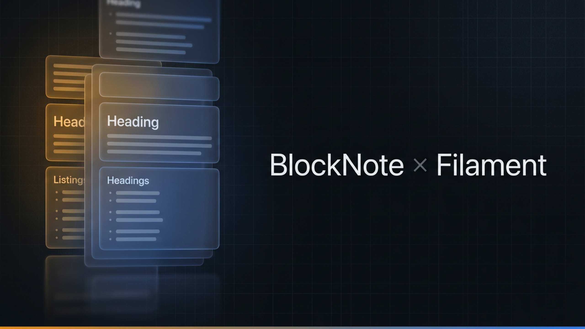
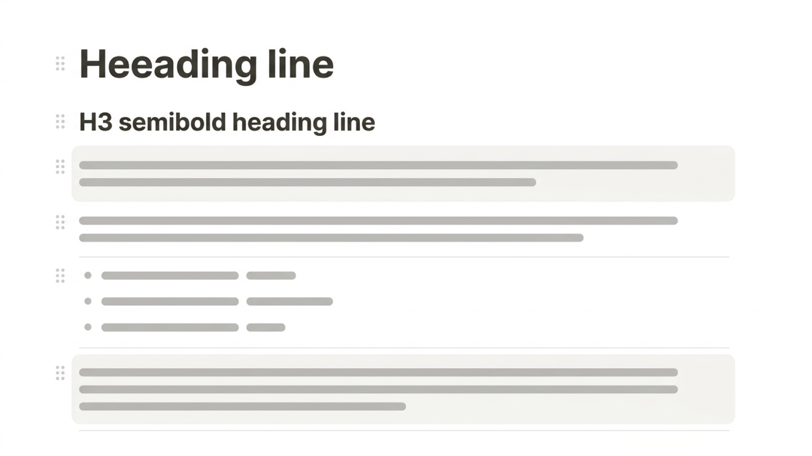

# Filament BlockNote (Weave)

[](https://packagist.org/packages/weave-php/blocknote-filament)
[](https://packagist.org/packages/weave-php/blocknote-filament)
[](https://packagist.org/packages/weave-php/blocknote-filament)



This package embeds the [BlockNote](https://www.blocknotejs.org/) rich-text editor in Filament forms, using a bundled **React** UI (BlockNote + Mantine), and persists document state as a **JSON string** of BlockNote blocks.

**Composer package:** `weave-php/blocknote-filament` · **PHP namespace:** `Weave\BlockNote\...` (unchanged on purpose so imports stay stable).

## Requirements

- PHP `^8.3`
- Laravel **11+** (as required by your Filament version)
- Filament `^3.0 || ^4.0 || ^5.0` (via `filament/filament`)

## Installation

```bash
composer require weave-php/blocknote-filament
```

Laravel auto-discovers `Weave\BlockNote\BlockNoteServiceProvider`.

Register the plugin on any panel (optional but recommended for consistency with Filament’s plugin API):

```php
use Filament\Panel;
use Weave\BlockNote\Filament\BlockNotePlugin;

public function panel(Panel $panel): Panel
{
    return $panel
        ->default()
        ->id('admin')
        ->path('admin')
        ->plugin(BlockNotePlugin::make());
}
```

Assets are registered globally by the service provider; the plugin is mainly an explicit hook for panel configuration.



### Publish Filament assets

After install or upgrade, publish JS/CSS to `public/`:

```bash
php artisan filament:assets
```

Files are published under `public/js/weave-php/blocknote-filament/` and `public/css/weave-php/blocknote-filament/`.

The editor loads **Inter** from Filament’s font bundle (`public/fonts/filament/filament/inter/`). Run `filament:assets` or `filament:install` so that path exists.

## Configuration

Publish the config file if you want to customize uploads and the upload route:

```bash
php artisan vendor:publish --tag=weave-blocknote-config
```

**Default configuration:**

```php
<?php

return [

    'uploads' => [
        'enabled' => env('WEAVE_BLOCKNOTE_UPLOADS_ENABLED', true),

        'disk' => env('WEAVE_BLOCKNOTE_UPLOADS_DISK', 'public'),

        'directory' => env('WEAVE_BLOCKNOTE_UPLOADS_DIRECTORY', 'blocknote'),

        'visibility' => env('WEAVE_BLOCKNOTE_UPLOADS_VISIBILITY', 'public'),

        'max_size_kb' => (int) env('WEAVE_BLOCKNOTE_UPLOADS_MAX_KB', 12_288),

        'middleware' => ['web', 'auth'],

        'throttle' => env('WEAVE_BLOCKNOTE_UPLOADS_THROTTLE', '60,1'),

        'authorize' => null,

        'response_url_key' => 'url',

        'input_name' => 'file',
    ],

];
```

**Configuration options:**

| Key | Description |
|-----|-------------|
| `uploads.enabled` | When `false`, the package upload route returns 404 and the field should not expose the default upload URL. |
| `uploads.disk` | Filesystem disk (default `public`). Use `public` so URLs work under `/storage/...` after `php artisan storage:link`. |
| `uploads.directory` | Directory on the disk where files are stored. |
| `uploads.visibility` | `public` or `private` (e.g. S3). |
| `uploads.max_size_kb` | Max upload size for Laravel’s `max` validation rule (kilobytes). |
| `uploads.middleware` | Route middleware stack (default `web`, `auth`). Adjust for `auth:sanctum` or your guard. |
| `uploads.throttle` | Laravel throttle string (e.g. `60,1`). Env: `WEAVE_BLOCKNOTE_UPLOADS_THROTTLE`. Set to an empty string to disable throttling on this route. |
| `uploads.authorize` | Optional `callable (\Illuminate\Http\Request $request): bool`. Set at runtime, e.g. `config()->set('weave-blocknote.uploads.authorize', fn ($r) => ...)` in a service provider. |
| `uploads.response_url_key` | JSON key for the file URL in the upload response (must match `uploadResponseUrlKey()` on the field if changed). |
| `uploads.input_name` | Form field name for the file (must match `uploadFieldName()` on the field if changed). |

## Usage

Add `BlockNoteEditor` to a form schema. State is a **JSON string** (BlockNote document).

```php
use Filament\Schemas\Schema;
use Weave\BlockNote\Forms\Components\BlockNoteEditor;

public static function form(Schema $schema): Schema
{
    return $schema->components([
        BlockNoteEditor::make('contents')
            ->label('Content')
            ->default('[]')
            ->minHeight(480)
            ->fullscreenButton()
            ->columnSpanFull(),
    ]);
}
```

Persist as `longText` or `json` in your migration.

### Field API

| Method | Description |
|--------|-------------|
| `minHeight(int\|string $height)` | Min height (`480` → `480px`, or any CSS length). Default `320px`. |
| `fullscreenButton(bool $enabled = true)` | Fullscreen toggle. Off until you call `fullscreenButton()`. |
| `blockNoteLocale(?string $locale)` | BlockNote UI language (`fr`, `en`, `zh-tw`, …). Falls back to `app()->getLocale()`. |
| `locale(?string $locale)` | Alias of `blockNoteLocale()`. Prefer `blockNoteLocale()`. |
| `disableUpload()` | Disables uploads in the editor. |
| `uploadUrl(?string $url)` | Custom upload endpoint (default: `POST` `weave-blocknote.upload`). |
| `uploadFieldName` / `uploadResponseUrlKey` | Must stay in sync with config if you change field / response shape. |
| `blocks` / `withoutBlocks` | Whitelist or blacklist BlockNote block types (`BlockNoteEditor::BLOCK_TYPES`). |

Standard Filament field methods (`label()`, `required()`, `rules()`, `columnSpanFull()`, …) apply.

### Uploads & custom storage

Default route: **`POST /weave-blocknote/upload`** (`weave-blocknote.upload`). Implement `Weave\BlockNote\Contracts\StoresBlockNoteUploads` and bind it in a service provider to use S3 or another backend; return a **public URL** string.

The bundled script sends `Accept: application/json`, `credentials: 'same-origin'`, and CSRF headers when available.

### Block types, localization, validation

- Restrict blocks with `->withoutBlocks([...])` or `->blocks([...])`.
- **Locale:** `->blockNoteLocale('fr')` or rely on `app()->getLocale()` ([BlockNote locales](https://www.blocknotejs.org/docs/features/localization)).
- **Validation:** `Weave\BlockNote\Rules\BlockNoteDocumentRule` — messages use `weave-blocknote::validation.blocknote_document.*` (override under `lang/vendor/weave-blocknote/{locale}/validation.php`).

### Tables & infolist

Plain-text preview helpers:

```php
use Weave\BlockNote\Tables\Columns\BlockNoteColumn;
use Weave\BlockNote\Infolists\Components\BlockNoteEntry;

BlockNoteColumn::make('contents');
BlockNoteEntry::make('contents');
```

`Weave\BlockNote\Support\BlockNoteDocument::toPlainText()` extracts preview text from JSON.

### Livewire & theming

The editor mount uses **`wire:ignore`**. Avoid replacing the field’s DOM subtree blindly. With Filament SPA / `wire:navigate`, full page loads may be more reliable if the editor fails to mount after navigation.

BlockNote uses **Mantine** inside the bundle; it does not automatically match Filament theme tokens or dark mode. Target `.weave-blocknote-shell` for custom CSS if needed.

## Translations

Namespace: `weave-blocknote` (e.g. `weave-blocknote::editor.enter_fullscreen`, `weave-blocknote::validation.blocknote_document.must_be_string`). Override via `lang/vendor/weave-blocknote/{locale}/` in your app.

## Development (this package)

```bash
cd vendor/weave-php/blocknote-filament   # or clone
npm install
npm run build
```

Outputs `dist/blocknote-editor.js` and `dist/blocknote-editor.css` (esbuild). Commit `dist/` if you ship prebuilt assets, then run `php artisan filament:assets` in consuming apps.

**Stack:** React 19, `@blocknote/mantine`, esbuild.

## Credits

[Weave PHP](https://weave-php.dev)

## License

MIT. See [LICENSE.md](LICENSE.md).
